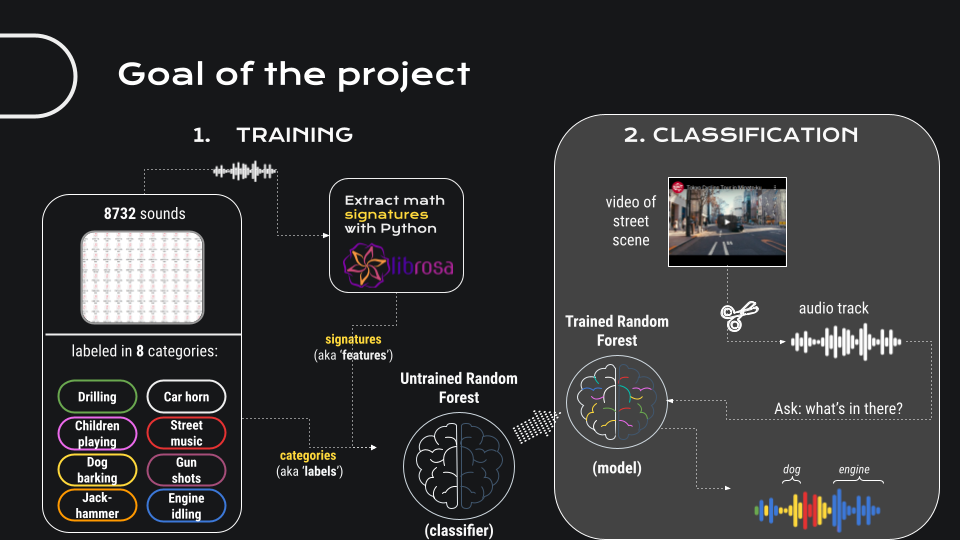

# Urban sound classification using machine learning

The aim of this project was to enable a machine to classify unknown urban sounds into 8 different categories. The automated classification of environmental sounds and specifically urban sounds is an active field of research (See references in [[2]](http://www.justinsalamon.com/uploads/4/3/9/4/4394963/salamon_urbansound_acmmm14.pdf)). From almost 7000 `.wav`-files audio features were extracted mathematically using *Librosa*, a Python library widely used in music and audio analysis. These features together with the corresponding categories of the urban sound were then used to train a machine learning model. Predicting the categories of 1700 (test) sounds from the same dataset, an accuracy score of around 90% was achieved with a random forest classifier, using an optimized number of trees as well as optimized number of features. Optimization was achieved by minimizing the *out of bag score* for the random forest.

*Goal of the project (slide taken from my final project presentation at the end of the Ironhack Bootcamp)*

# 1. Dataset

The source is the *UrbanSound8K* [dataset](https://urbansounddataset.weebly.com/) compiled by Justin Salamon, Christopher Jacoby and Juan Pablo Bello and can be used under the *Creative Commons Attribution Noncommercial License* (by-nc). It contains 8732 labeled sound samples from field recordings uploaded to www.freesound.org, each with a duration of below 4 seconds. A meta `.csv`-file is also provided, which allows to connect filenames with the sound class. The 10 classes of the sounds were:

* `air_conditioner`
* `car_horn`
* `children_playing`
* `dog_bark`
* `drilling`
* `engine_idling`
* `gun_shot`
* `jackhammer`
* `siren`
* `street_music`

# 2. Feature generation

## 2.1. librosa features
## 2.2. Gathering all data in a dataframe

# 3. Machine learning

sklearn pipepline, standard scaler, random forest, model export

## Hyperparameter tuning

# Results

# Structure of the project

folders:

* `data`
* `img`

notebooks:

|        filename           |    description     |
|:--------------------------|--------------------|
| `ml.ipynb`                ||
| `exploring_librosa.ipynb` ||
| `demonstrator.ipynb`      | A demonstrator built for the final project presentation |

modules:

|        filename           |    description     |
|:--------------------------|--------------------|
| `generate_features.py`    ||
| `structure_helpers.py`    ||

# Links

* Source of the dataset: https://urbansounddataset.weebly.com/
* [2] Explaining paper for the dataset by Salamon et. al, [link](http://www.justinsalamon.com/uploads/4/3/9/4/4394963/salamon_urbansound_acmmm14.pdf)
