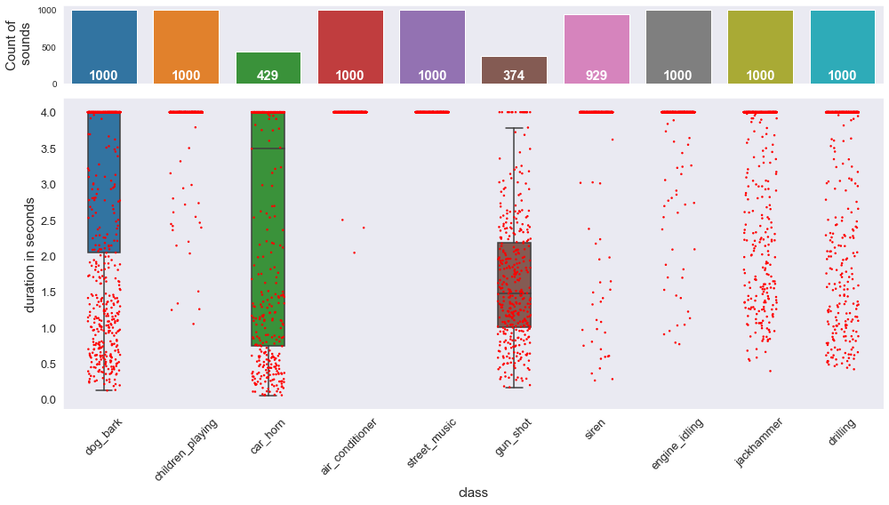
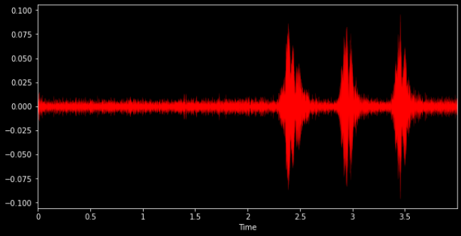
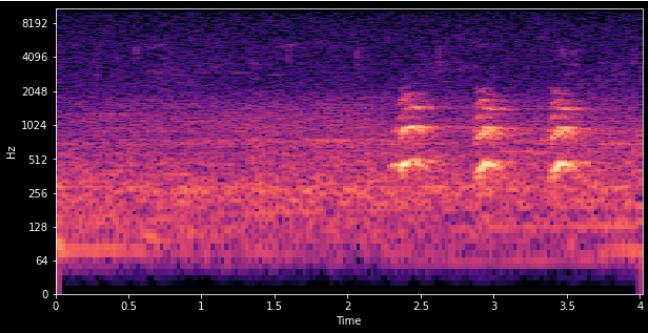
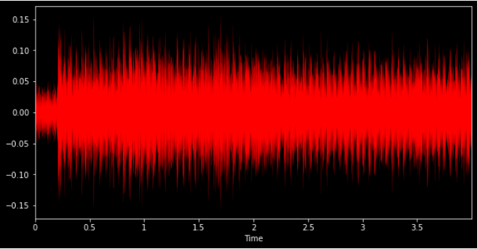
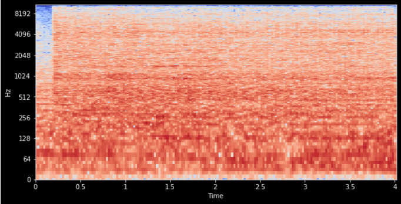
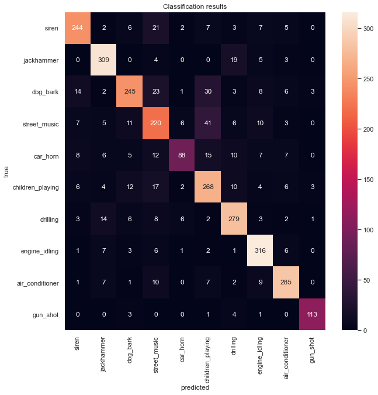
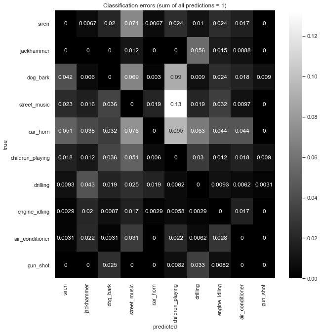

**this readme is in the process of being revised, 06th of July 2021**

# Urban sound classification using machine learning

The aim of this project was to enable a machine to classify unknown urban sounds into 8 different categories. The automated classification of environmental sounds and specifically urban sounds is an active field of research (See references in [[2]](http://www.justinsalamon.com/uploads/4/3/9/4/4394963/salamon_urbansound_acmmm14.pdf)). From almost 7000 `.wav`-files audio features were extracted mathematically using *Librosa*, a Python library widely used in music and audio analysis. These features together with the corresponding categories of the urban sound were then used to train a machine learning model. Predicting the categories of 1700 (test) sounds from the same dataset, an accuracy score of around 90% was achieved with a random forest classifier, using an optimized number of trees as well as optimized number of features. Optimization was achieved by minimizing the *out of bag score* for the random forest.


*Goal of the project (slide taken from my final project presentation at the end of the Ironhack Bootcamp)*

# 1. Dataset

The source is the *UrbanSound8K* [dataset](https://urbansounddataset.weebly.com/) compiled by Justin Salamon, Christopher Jacoby and Juan Pablo Bello and can be used under the *Creative Commons Attribution Noncommercial License* (by-nc). It contains 8732 labeled sound samples from field recordings uploaded to www.freesound.org, each with a duration of below 4 seconds. A meta `.csv`-file is also provided, which allows to connect filenames with the sound class (the ultimate label *y* to predict). The 10 classes of the sounds were:

* `air_conditioner`
* `car_horn`
* `children_playing`
* `dog_bark`
* `drilling`
* `engine_idling`
* `gun_shot`
* `jackhammer`
* `siren`
* `street_music`

## 1.1 Data exploration

Except the classes `car_horn` and `gunshot`, all other classes are represented fairly evenly with around 1000 sound files. Something to keep in mind for later which makes sampling procedures necessary. Most sound files show a duration of 4 seconds but throughout the classes the duration can be spread out over the whole 0 to 4 second range (again, `gun_shot` e.g.).



# 2. Feature generation

## 2.1. Librosa features

Librosa's `core.load()` function is used to load the sound files as an audio time series into Jupyter Notebook (together with their corresponding sampling rate). Librosa ensures that all sampling rates are set to 22.05 KHz and normalises the data so the bit-depth values range between -1 and 1. Also all audio channels will be transformed into mono. In a next step, for all songs, spectral features were then calculated (user can specify those in a Python dictionary. YAML support will be implemented later) making use of the `librosa.feature` [functions](https://librosa.org/doc/main/feature.html#spectral-features). For each feature generated, statistical measures can be applied (default: `np.std`, `np.mean`). In principle, the code is flexible and the user can add / remove spectral features as well as statistical measures. Those resulting features span the feature space X for the actual machine learning problem, in which the sound class *y* is to be predicted.

How the computer distinguishes classes according to the audio features is illustrated in the following. Librosa allows to plot among other things **amplitude over time** with `librosa.display.waveplot()` or **frequency spectra over time** with `librosa.display.specshow()`. Those are shown for a `dog_bark` in the following.  whose spectra are shown afterwards.

<table>
    <thead>
        <tr>
          <th>Amplitude envelope of the waveform of a <code>dog_bark</code></th>
          <th>Frequency spectrum of a <code>dog_bark</code></th>
        </tr>
    </thead>
    <tbody>
        <tr>
          <td></td>
            <td></td>
        </tr>
        <tr>
          <td colspan=2 align="center">Filename <code>161922-3-1-5.wav</code></td>
        </tr>
    </tbody>
</table>

Harmonic frequency multipliers are clearly visible. It's presence is an important feature of that class `dog_bark` which sets it apart from classes whose sounds don't emerge from resonant bodies, let's say for example a `jackhammer`:

<table>
    <thead>
        <tr>
          <th>Amplitude envelope of the waveform of a <code>jackhammer</code></th>
          <th>Frequency spectrum of a <code>jackhammer</code></th>
        </tr>
    </thead>
    <tbody>
        <tr>
          <td></td>
            <td></td>
        </tr>
        <tr>
          <td colspan=2 align="center">Filename <code>103074-7-0-0.wav</code></td>
        </tr>
    </tbody>
</table>

## 2.2. Gathering all data in a dataframe

# 3. Machine learning

sklearn pipepline, standard scaler, random forest, model export

## Hyperparameter tuning
## Feature selection
### Recursive Feature elimination

# Results

## Confusion Matrix

For a baseline model, a Random Forest classifier from the `sklearn.ensemble` was trained with a test ratio of 0.33 and default values being:

* `n_estimators=100`,
* `criterion='gini'`,
* `max_depth=None`,
* `min_samples_split=2`,
* `min_samples_leaf=1`,
* `min_weight_fraction_leaf=0.0`,
* `max_features='auto'`,
* `max_leaf_nodes=None`,
* `min_impurity_decrease=0.0`,
* `min_impurity_split=None`,
* `bootstrap=True`,
* `oob_score=False`,
* `n_jobs=None`,
* `random_state=None`,
* `verbose=0`,
* `warm_start=False`,
* `class_weight=None`,
* `ccp_alpha=0.0`,
* `max_samples=None`,

It achieved an accuracy score of 0.82 but looking at the confusion matrix and the errors for the predicted classes it becomes apparent where the model is struggling: 

Confusion matrix results             |  Confusion matrix prediction errors (main diagonal set to 0)
:-------------------------:|:-------------------------:
  |  

## AUC /ROC

## Feature importance & interpretation

## Modelling using the predefined folds

# Outlook

### Further development

* Build an inference API (with FastAPI and SpaCy maybe, hug for terminal access)
* Build a web app with Flask or Streamlit featuring sound inference.
* Build front-end app MVPs for mobile for sound inference.
* Package the model with Docker / docker-compose, or in a first step just as Python module e.g. 
    ```python
    from usc import UrbanSoundClassifier
    
    u = UrbanSoundClassifier()
    u.audio = "music/testfile.wav"
    u.predict()
    ```

### Model improvement (Backend) 
* User can be enabled to provide feature generation configurations by YAML.
* In this project, audio features were calculated mathematically directly from the audio time series and bitrates of the individual sound files. These audio features then spanned the feature space. Another approach which sounds rather unorthodox at first is to generate for every song a frequency spectrum as an image and then use this image as an input for a Convolutional Neural Network to train and predict the class (for example [3]). Accuracy scores of 92% are reported in this case.


<!--
# Structure of the project

notebooks:

|        filename           |    description     |
|:--------------------------|--------------------|
| `final_project.ipynb`     | main notebook |

folders:

* `img`

modules:

|        filename           |    description     |
|:--------------------------|--------------------|
|  ||
-->

# Links

* Source of the dataset: https://urbansounddataset.weebly.com/
* [2] Explaining paper for the dataset by Salamon et. al, [link](http://www.justinsalamon.com/uploads/4/3/9/4/4394963/salamon_urbansound_acmmm14.pdf)
* [3] "Sound Classification using Deep Learning" - by Mike Smales, 2019, on [medium.com](https://mikesmales.medium.com/sound-classification-using-deep-learning-8bc2aa1990b7)
